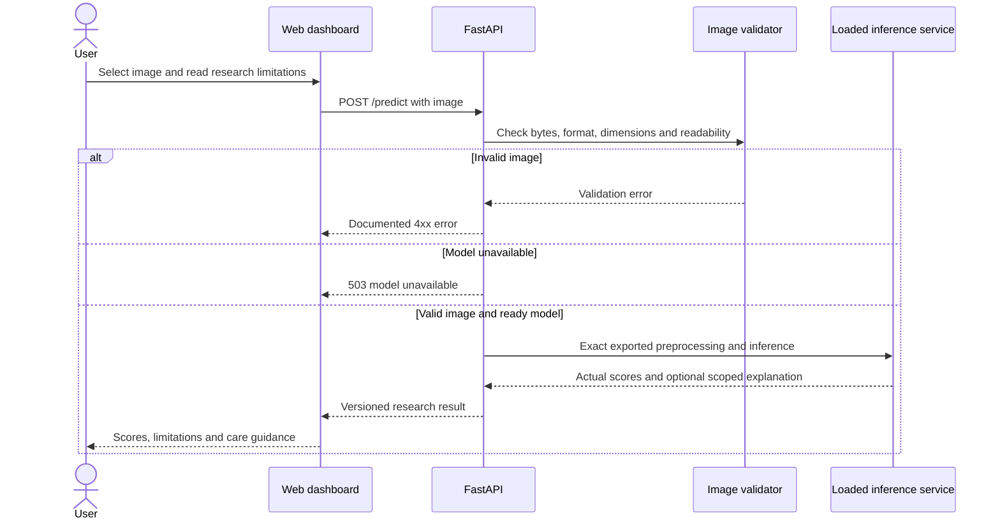
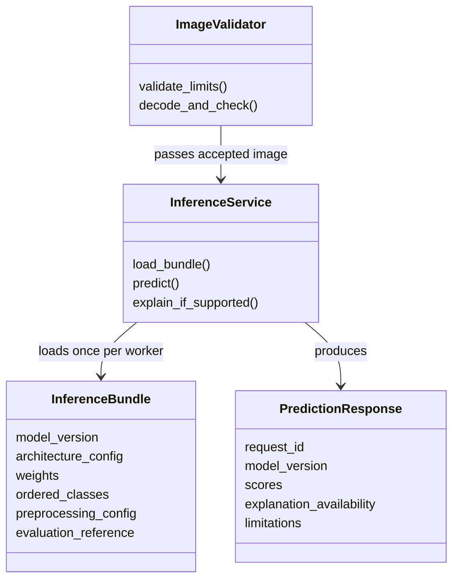

# Initial design diagrams

Phase 1 design only; implementation names may be refined in approved phases.

```mermaid
sequenceDiagram
    actor User
    participant Web as Web dashboard
    participant API as FastAPI
    participant Validator as Image validator
    participant Model as Loaded inference service
    User->>Web: Select image and read research limitations
    Web->>API: POST /predict with image
    API->>Validator: Check bytes, format, dimensions and readability
    alt Invalid image
        Validator-->>API: Validation error
        API-->>Web: Documented 4xx error
    else Model unavailable
        API-->>Web: 503 model unavailable
    else Valid image and ready model
        API->>Model: Exact exported preprocessing and inference
        Model-->>API: Actual scores and optional scoped explanation
        API-->>Web: Versioned research result
        Web-->>User: Scores, limitations and care guidance
    end
```

```mermaid
classDiagram
    class InferenceBundle {
        model_version
        architecture_config
        weights
        ordered_classes
        preprocessing_config
        evaluation_reference
    }
    class InferenceService {
        load_bundle()
        predict()
        explain_if_supported()
    }
    class ImageValidator {
        validate_limits()
        decode_and_check()
    }
    class PredictionResponse {
        request_id
        model_version
        scores
        explanation_availability
        limitations
    }
    InferenceService --> InferenceBundle : loads once per worker
    InferenceService --> PredictionResponse : produces
    ImageValidator --> InferenceService : passes accepted image
```
